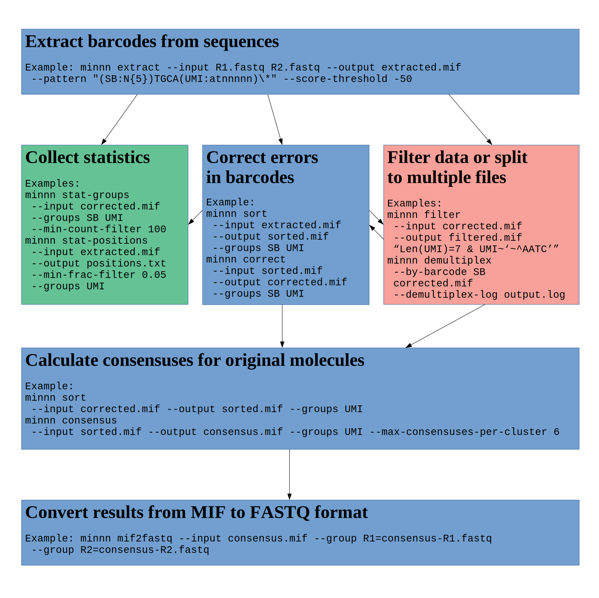

Welcome to Mist's documentation!
================================

Contents:

.. toctree::
    :maxdepth: 2

    commands

Overview
========

Mist is toolset to process genetic data from sequencing machines and assemble sequenced molecules by raw FASTQ data.

Indices and tables
==================

* :ref:`genindex`
* :ref:`modindex`
* :ref:`search`
